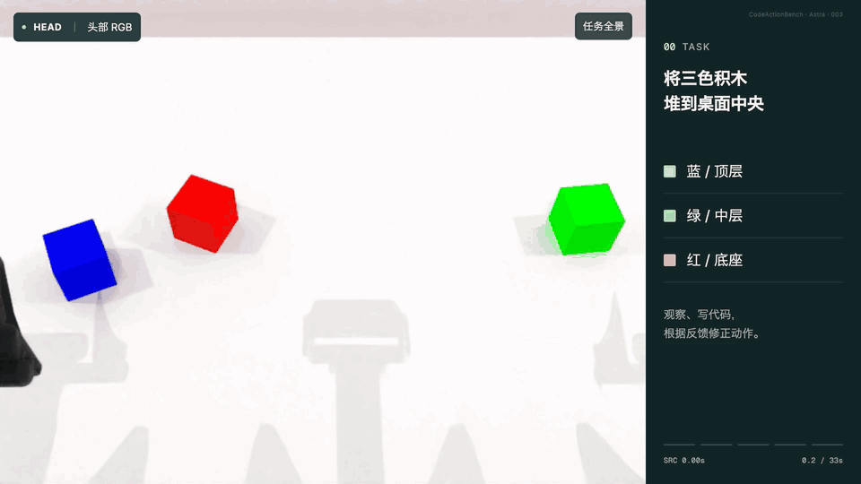

#  CodeActionBench

[English](README.md) · **简体中文**

[项目网站](https://codeactionbench.org/) ·
[论文](https://arxiv.org/abs/2609.33807) ·
完整数据（即将发布） · [快速开始](QUICKSTART.md) · [文档](docs/README.md)

CodeActionBench 评测通用多模态模型能否通过可执行代码，将视觉理解与推理转化为具身操作。
基准包含 25 项操作任务，采用由智能体自主编写、执行和修正代码策略的 Code-as-Policy 形式。

[](https://codeactionbench.org/)

*三种智能体配置在 25 项任务上的执行示例。点击总览图，可在项目网站查看具体运行过程。*

在不使用任务专用微调、示范、外部专用感知或抓取模块、特权场景状态及预定义任务策略的条件下，
智能体需要自行选择视觉证据、估计与任务相关的三维信息、构建操作目标，并反复执行和修正策略。

统一的机器人 API 提供 RGB 观测、经过标定的几何运算、机器人反馈和受限运动，
将任务相关的决策留给被评测的智能体。固定的任务实例、资源预算和隐藏的物理结果验证器，
支持在受控条件下比较不同模型与智能体运行框架的配置。

仓库提供的参考运行框架用于调用 API 模型。Codex CLI 和 Claude Code 通过 MCP 连接机器人工具。

## 结果与轨迹

评测共包含 675 次尝试：25 项任务 × 9 种智能体配置 × 每项 3 次尝试。
包含轨迹、观测图像和视频的完整数据集即将发布。
评测结果见[论文](https://arxiv.org/abs/2609.33807)，运行示例见[项目网站](https://codeactionbench.org/)。

### 从观测到代码与动作

Astra（Codex）根据相机图像估计积木位置，再编写并运行代码控制机器人堆叠。
夹爪碰落顶层积木后，智能体查看新图像并调整代码，重新放好积木，再改变撤手方式，避免再次碰落。



*智能体如何根据观察编写代码，再根据反馈调整动作。双臂交接等更多示例见[项目网站](https://codeactionbench.org/)。*

## 快速开始

运行环境需要 Linux x86-64、NVIDIA GPU、Docker Compose、NVIDIA Container Toolkit 和 Python 3.10+。
安装与演示建议预留 120 GB 磁盘空间，完整评测与结果导出建议预留 150 GB。
具体要求见[主机配置](QUICKSTART.md#1-prepare-the-linux-host)。

在仓库根目录安装环境，并检查模拟器与机器人工具是否正常工作：

```bash
bash tools/setup.sh venv
bash tools/reproduce.sh check --gpus 0
```

安装过程会下载所需资源和固定版本的容器镜像。使用 Conda 时，将第一条命令替换为
`bash tools/setup.sh conda`。检查需要 GPU，无需模型凭据，也不消耗 API 配额。

如需在单个任务上试运行模型，请参阅 [Gemini 演示](QUICKSTART.md#3-run-one-gemini-attempt-and-watch-it)
和[结果查看说明](QUICKSTART.md#4-read-the-result)。模型运行会消耗 API 或订阅配额。
论文中全部九种配置的运行方法见[完整复现指南](QUICKSTART.md#5-full-reproduction)。

## 文档

以下详细技术文档使用英文。

| 指南 | 内容 |
|---|---|
| [快速开始](QUICKSTART.md) | 安装、首次运行、完整评测、报告与故障恢复 |
| [评测配置](configs/reproduce/README.md) | 论文中的九种模型与智能体设置 |
| [评测协议](docs/evaluation.md) | 尝试次数、评分、证据记录与结果比较 |
| [扩展指南](EXTENDING.md) | 添加模型、智能体、工具、验证器与任务 |
| [开发指南](docs/development.md) | 源码修改、实验快照与检查 |
| [全部文档](docs/README.md) | 配置、身份验证、结果导出与镜像管理 |

任务定义位于 [`benchmark/tasks/`](benchmark/tasks/)，运行时代码位于 [`src/codeaction/`](src/codeaction/)，
可运行的扩展示例位于 [`examples/`](examples/)。

## 引用

```bibtex
@article{lyu2026codeactionbench,
  title={CodeActionBench: Evaluating Agentic Code-as-Policy for Embodied Manipulation},
  author={Lyu, Yiheng and Jiang, Xueying and Li, Wenhao and Lu, Shijian and Zhang, Gongjie},
  journal={arXiv preprint arXiv:2609.33807},
  year={2026},
  url={https://arxiv.org/abs/2609.33807}
}
```

## 许可与致谢

代码采用 [MIT 许可证](LICENSE)。评测数据集将以 CC BY 4.0 许可发布。

感谢 [RoboTwin](https://github.com/RoboTwin-Platform/RoboTwin) 团队开源 CodeActionBench 所基于的仿真平台与机器人资源。
上游许可与归属说明见[后端文档](backend/README.md)。
