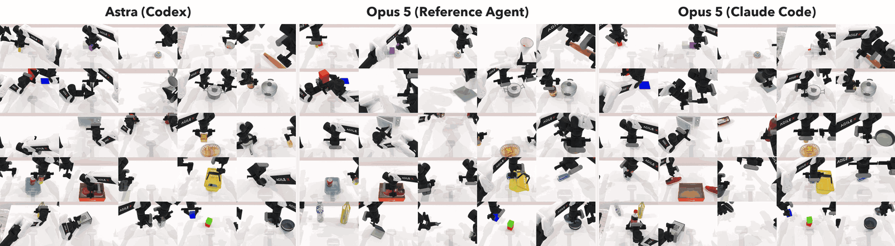
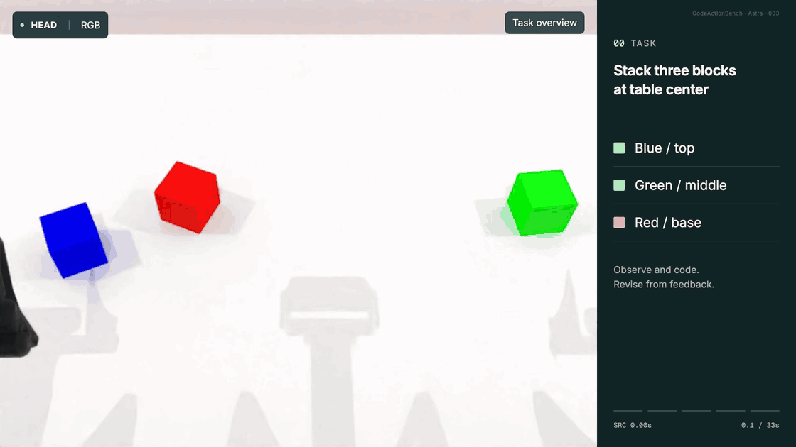

#  CodeActionBench

**English** · [简体中文](README-zh.md)

[Project website](https://codeactionbench.org/) ·
[Paper](https://arxiv.org/abs/2609.33807) ·
Full data (coming soon) · [Quickstart](QUICKSTART.md) · [Documentation](docs/README.md)

CodeActionBench evaluates how well general-purpose multimodal models turn visual
understanding and reasoning into embodied manipulation via executable code. The
benchmark contains 25 manipulation tasks that evaluate this capability through
agentic Code-as-Policy.

[](https://codeactionbench.org/)

*Selected executions across 25 tasks for three agent configurations. Click the
overview to explore example runs on the project website.*

Without task-specific fine-tuning, demonstrations, external specialist perception
or grasp modules, privileged scene state, or predefined task policies, agents
should select visual evidence, form task-relevant 3D estimates, construct
manipulation targets, and iteratively execute and revise their policies.

A shared robot API provides RGB observations, calibrated geometric operations,
robot feedback, and bounded motion, leaving task-dependent decisions to the
evaluated agent. Fixed task instances, resource budgets, and a hidden
physical-outcome verifier support controlled comparisons across models and
harness configurations.

The included reference harness runs API models. Codex CLI and Claude Code connect
to the robot tools through MCP.

## Results and trajectories

The evaluation covers 675 attempts: 25 tasks × 9 agent configurations × 3 attempts.
The complete dataset, including trajectories, observation images, and videos, is
coming soon. See the [paper](https://arxiv.org/abs/2609.33807) for results and the
[project website](https://codeactionbench.org/) for example runs.

### From observations to code and action

Astra (Codex) uses camera images to estimate block positions, then writes and
runs code to stack them. When the gripper knocks the top block off, the agent
checks a new image and adjusts its code to put the block back and withdraw
without disturbing the stack.



*How an agent writes code from observations and adjusts its actions based on
feedback. More examples, including a two-arm handover, are on the
[project website](https://codeactionbench.org/).*

## Getting started

You need Linux x86-64, an NVIDIA GPU, Docker Compose, NVIDIA Container Toolkit,
and Python 3.10+. Reserve 120 GB for setup and demos, or 150 GB for
a full evaluation and export. See [host setup](QUICKSTART.md#1-prepare-the-linux-host)
for prerequisites.

From the repository root, install the environment and check that the simulator
and robot tools work:

```bash
bash tools/setup.sh venv
bash tools/reproduce.sh check --gpus 0
```

Setup downloads the resources and pinned container images. If you use Conda,
replace the first command with `bash tools/setup.sh conda`. The check uses a GPU
but needs no model credentials or API quota.

To try a model on one task, follow the [Gemini demo](QUICKSTART.md#3-run-one-gemini-attempt-and-watch-it)
and [result viewing instructions](QUICKSTART.md#4-read-the-result). Model runs use
API or subscription quota. For all nine published configurations, see the
[full evaluation guide](QUICKSTART.md#5-full-reproduction).

## Documentation

| Guide | Contents |
|---|---|
| [Quickstart](QUICKSTART.md) | Installation, first run, full evaluation, reports, and recovery |
| [Evaluation configurations](configs/reproduce/README.md) | The nine published model and agent settings |
| [Evaluation protocol](docs/evaluation.md) | Attempts, scoring, recorded evidence, and result comparison |
| [Extensions](EXTENDING.md) | Add your own models, agents, tools, verifiers, and tasks |
| [Development](docs/development.md) | Source changes, experiment snapshots, and checks |
| [All documentation](docs/README.md) | Configuration, authentication, result export, and image management |

Task definitions are in [`benchmark/tasks/`](benchmark/tasks/), the runtime is in
[`src/codeaction/`](src/codeaction/), and runnable extension examples are in
[`examples/`](examples/).

## Citation

```bibtex
@article{lyu2026codeactionbench,
  title={CodeActionBench: Evaluating Agentic Code-as-Policy for Embodied Manipulation},
  author={Lyu, Yiheng and Jiang, Xueying and Li, Wenhao and Lu, Shijian and Zhang, Gongjie},
  journal={arXiv preprint arXiv:2609.33807},
  year={2026},
  url={https://arxiv.org/abs/2609.33807}
}
```

## License and acknowledgments

The code uses the [MIT License](LICENSE). The evaluation dataset will be released
under CC BY 4.0.

We thank the [RoboTwin](https://github.com/RoboTwin-Platform/RoboTwin) team for
open-sourcing the simulation platform and robot assets that CodeActionBench builds
on. See the [backend documentation](backend/README.md) for upstream licenses and
attribution.
